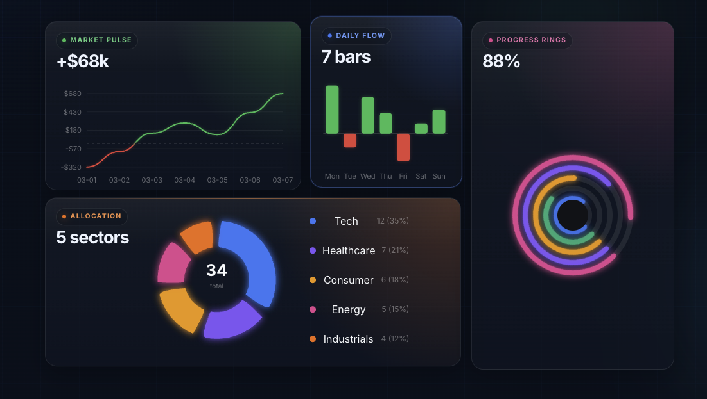

# vue-dark-charts

[](https://github.com/andreizet/vue-dark-charts/actions/workflows/ci.yml)
[](https://www.npmjs.com/package/vue-dark-charts)
[](https://andreizet.github.io/vue-dark-charts/)
[](./LICENSE)

`vue-dark-charts` is a Vue 3 chart library with responsive SVG components, dark-first styling, and minimal setup.

It is designed for dashboards, admin panels, portfolio views, analytics pages, and internal tools where you want lightweight charts without pulling in a large charting runtime.

Documentation: [andreizet.github.io/vue-dark-charts](https://andreizet.github.io/vue-dark-charts/)



## Install

```bash
npm install vue-dark-charts vue
```

Full docs and live examples: [andreizet.github.io/vue-dark-charts](https://andreizet.github.io/vue-dark-charts/)

## What you get

- `LineChart`
- `MultiLineChart`
- `RainbowLineChart`
- `BarChart`
- `HorizontalBarChart`
- `PieChart`
- `DonutChart`
- `RadialChart`
- `RadarChart`

## Quick start

```vue
<script setup lang="ts">
import { LineChart } from 'vue-dark-charts'
import 'vue-dark-charts/style.css'

const revenue = [
  { x: 'Mon', y: 1200 },
  { x: 'Tue', y: 1800 },
  { x: 'Wed', y: 1500 },
  { x: 'Thu', y: 2100 },
  { x: 'Fri', y: 2400 },
]
</script>

<template>
  <div style="height: 280px;">
    <LineChart
      :points="revenue"
      theme="dark"
      value-mode="currency"
      color="#38bdf8"
    />
  </div>
</template>
```

## Layout and sizing

Charts are responsive and fill the size of their container.

- Set a height on the wrapper for cartesian charts like `LineChart`, `BarChart`, and `RadarChart`
- Width is handled automatically
- Empty states render automatically when no usable data is provided

Example:

```vue
<div style="height: 320px;">
  <BarChart :bars="bars" />
</div>
```

## Shared props

Most components support a consistent set of props:

| Prop | Type | Default | Notes |
| --- | --- | --- | --- |
| `theme` | `'dark' \| 'light' \| 'auto'` | usually `'dark'` | `auto` follows the current color scheme |
| `neon` | `boolean` | `true` | Enables the glow-heavy visual style |
| `format` | `(value: number) => string` | — | Use for custom tooltip/label formatting |

Charts with axis-based numeric values also support:

| Prop | Type | Default |
| --- | --- | --- |
| `valueMode` | `'currency' \| 'percent' \| 'number'` | varies by chart |

## Choose the right chart

### `LineChart`

Use for one series or multiple series on the same x-axis.

Key props:

- `points?: ChartPoint[]`
- `series?: MultiLineSeries[]`
- `color?: string`
- `colors?: string[]`
- `dotted?: boolean`
- `showZeroLine?: boolean`
- `smooth?: boolean`
- `valueMode?: 'currency' | 'percent' | 'number'`

```vue
<LineChart :points="points" smooth :show-zero-line="false" />
```

### `MultiLineChart`

Convenience wrapper for multi-series line charts.

Key props:

- `series: MultiLineSeries[]`
- `colors?: string[]`
- `dotted?: boolean`
- `showZeroLine?: boolean`
- `smooth?: boolean`

```vue
<MultiLineChart :series="series" value-mode="number" />
```

### `RainbowLineChart`

Use when values cross zero and you want positive and negative zones to read differently.

Key props:

- `points: ChartPoint[]`
- `positiveColor?: string`
- `negativeColor?: string`
- `dotted?: boolean`
- `showZeroLine?: boolean`
- `smooth?: boolean`

```vue
<RainbowLineChart
  :points="profitAndLoss"
  positive-color="#10b981"
  negative-color="#ef4444"
/>
```

### `BarChart`

Supports:

- single-series bars with `bars`
- grouped multi-series bars with `series`
- stacked bars with `stacked`
- vertical and horizontal layouts
- solid colors or gradients

Key props:

- `bars?: BarDatum[]`
- `series?: BarSeries[]`
- `orientation?: 'vertical' | 'horizontal'`
- `stacked?: boolean`
- `colors?: string[]`
- `gradients?: BarGradient[]`
- `valueMode?: 'currency' | 'percent' | 'number'`

```vue
<BarChart
  :series="departmentSpend"
  orientation="horizontal"
  stacked
  value-mode="currency"
/>
```

### `HorizontalBarChart`

Alias for `BarChart` with `orientation="horizontal"`.

```vue
<HorizontalBarChart :bars="bars" />
```

### `PieChart`

Use for share-of-total visuals when you want a full pie instead of a center hole.

Key props:

- `segments: PieSegment[]`

Events:

- `segment-click`

```vue
<PieChart
  :segments="segments"
  @segment-click="handleSegmentClick"
/>
```

Notes:

- segments with non-positive values are ignored
- clicking a segment emits `segment-click`
- clicking the legend also toggles segment visibility inside the chart

### `DonutChart`

Good for composition and share-of-total visuals.

Key props:

- `segments: DonutSegment[]`
- `centerText?: string`

Events:

- `segment-click`

```vue
<DonutChart
  :segments="segments"
  center-text="Traffic"
  @segment-click="handleSegmentClick"
/>
```

Notes:

- segments with non-positive values are ignored
- clicking a segment emits `segment-click`
- clicking the legend also toggles segment visibility inside the chart

### `RadialChart`

Best for progress rings, KPIs, and scorecards.

Key props:

- `rings: RadialRing[]`
- `centerText?: string`
- `centerLabel?: string`
- `startAngle?: number`
- `ringGap?: number`

Events:

- `ring-click`

```vue
<RadialChart
  :rings="kpis"
  center-text="86%"
  center-label="completion"
  @ring-click="handleRingClick"
/>
```

### `RadarChart`

Use for comparing categories across one or more series.

Key props:

- `points?: ChartPoint[]`
- `series?: RadarSeries[]`
- `color?: string`
- `colors?: string[]`
- `maxValue?: number`
- `gridLevels?: number`
- `showDots?: boolean`
- `valueMode?: 'currency' | 'percent' | 'number'`

```vue
<RadarChart :series="skills" :grid-levels="6" show-dots />
```

## Types

```ts
type ChartTheme = 'dark' | 'light' | 'auto'
type ValueMode = 'currency' | 'percent' | 'number'

type ChartPoint = {
  x: string
  y: number
}

type MultiLineSeries = {
  name: string
  color?: string
  dotted?: boolean
  points: ChartPoint[]
}

type BarDatum = {
  label: string
  value: number
  color?: string
  gradient?: BarGradient
}

type BarSeries = {
  name: string
  color?: string
  gradient?: BarGradient
  bars: BarDatum[]
}

type DonutSegment = {
  label: string
  value: number
  color?: string
}

type PieSegment = {
  label: string
  value: number
  color?: string
}

type RadialRing = {
  label: string
  value: number
  max?: number
  color?: string
}

type RadarSeries = {
  name: string
  color?: string
  fillOpacity?: number
  points: ChartPoint[]
}
```

## Notes

- `vue` is a peer dependency
- import styles with `import 'vue-dark-charts/style.css'`
- charts are rendered with SVG, so they are easy to style and scale cleanly

## Publishing

After the initial npm setup, releases are tag-driven:

```bash
npm version patch
git push origin main --follow-tags
```

That flow will:

- update the package version
- push the matching `v*` git tag
- publish the new version to npm through GitHub Actions
- create a GitHub Release with generated notes for the same tag

Full contributor and release notes live in [docs/publishing.md](./docs/publishing.md).
